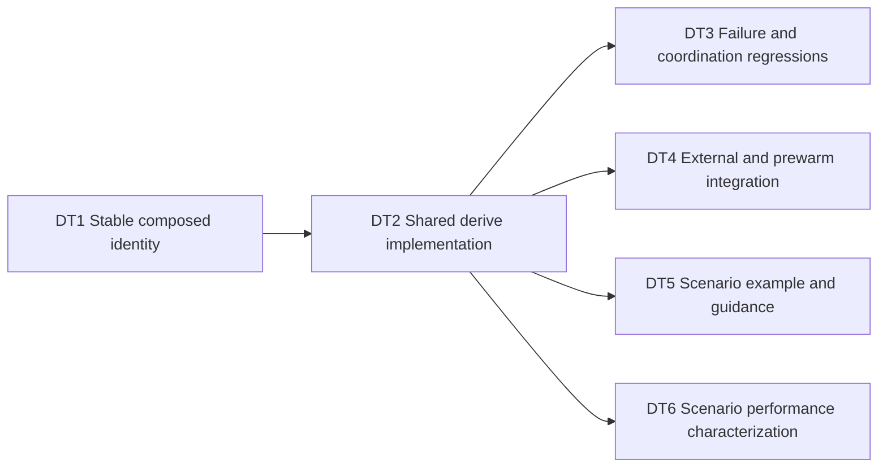

# Composable cached database scenarios

Status: implementation in progress; delivery beads record completion and validation.
Date: 2026-09-06.
Source baseline: `8a460ca`.
Owner: Beads epic `postgres-test-harness-j82`.

## 1. Outcome

Add one public operation:
`DatabaseTemplate::derive(spec, initializer)`.
It gets or builds an immutable child template by copying its parent and
applying a caller-supplied initialization step to that copy.
The result is the existing `DatabaseTemplate` type.
Tests continue to acquire isolated disposable databases using `database()`.

The motivating workload has a migrated schema, shared organization fixtures,
and several business scenarios with overlapping setup.
Today every independently cached template begins at PostgreSQL `template0`.
Consumers either repeat shared setup in those initializers or repeat it in
every disposable database.
Derivation lets those consumers cache the shared preparation once and branch
from it without changing their application database client.

```text
migrated schema
  organization and users
    active subscription
      overdue invoice
      exhausted quota
    cancelled subscription
```

This is a tree of construction dependencies, with reusable handles at each
node; version one does not introduce a graph executor.
Each child has exactly one parent.
Applications express sequencing and branching in ordinary Rust.

The feature is successful when callers can:

1. Build a populated parent with the existing root-template API.
2. Derive a child by applying only its additional setup.
3. Acquire the same child repeatedly without rerunning successful setup.
4. Derive grandchildren using the same API.
5. Change a declared ancestor input and obtain new descendant identities.
6. Mutate test clones without changing ancestors, siblings, or later clones.
7. Drop ancestor handles without preventing a finished child from being used.
8. Recover from interrupted child initialization through existing protocols.
9. Use the feature in both owned-container and external-server configurations.

## 2. Scope

### Included

- A documented additive public `derive` method.
- A private stable composition function for child fingerprints.
- Shared root/child template acquisition code.
- Owned source retention across blocking child creation.
- The existing coordination, sealing, error, and admission policies.
- Regression tests with observable database state and lock evidence.
- A runnable branching-scenario example.
- README and operations guidance.
- A measured comparison with repeated fixture preparation.
- Delivery beads with concrete outcomes and dependency edges.

### Excluded

- Taking a snapshot of an active mutable `DatabaseLease`.
- Merging two parent databases.
- A public scenario registry, declarative DSL, or graph scheduler.
- Incremental storage, filesystem snapshots, or copy-on-write claims.
- Cross-server export/import or a distributed artifact store.
- Automatic hashing of arbitrary Rust closures or their captured values.
- Automatic rollback of HTTP calls, queues, files, or other external effects.
- New ORM dependencies or application-specific fixture interfaces.
- A global initializer connection quota or template eviction policy.
- Global redesign of root-template cancellation or shutdown.
- Database-level settings/privilege replication beyond PostgreSQL cloning.
- Automatically publishing a crate release or committing this plan.

These exclusions keep the change centered on a reusable database primitive.
They also avoid suggesting that a database copy captures every part of an
application's environment.

## 3. Grounded repository map

All paths are relative to the repository root.
Symbol names are the primary anchors because line numbers will move.

| File | Existing responsibility | Feature interaction |
| --- | --- | --- |
| `src/fingerprint.rs` | SHA-256 identities, framing, `TemplateSpec` | Add private composition and document spec meaning |
| `src/harness.rs` | Public handles, initialization, prewarming, stale sweep | Add derive and share acquisition logic |
| `src/server.rs` | Weak template cache, retained locks, blocking bridge | Reuse cache; validate owned source lifetime |
| `src/admin.rs` | SQL operations, metadata compensation, timeouts | Reuse classified managed creation |
| `src/admission.rs` | Terminal admission and lease permits | Child creation must pass existing admission |
| `src/metadata.rs` | Strict version-one database comments | Keep metadata format unchanged |
| `src/name.rs` | Validated deterministic/unique database names | Use composite child identity for template naming |
| `src/error.rs` | Public non-exhaustive errors | Reuse existing initializer and cleanup errors |
| `src/lib.rs` | Public exports and README doctests | No new type export is expected |
| `tests/postgres.rs` | Ignored Docker-backed lifecycle tests | Add owned coordination/lifetime regressions |
| `tests/external_only.rs` | External-only lifecycle and feature contract | Add external derive coverage |
| `examples/downstream_adapter.rs` | Application adapter pattern | Follow its connection/cleanup discipline |
| `examples/performance.rs` | Versioned JSON characterization | Add scenario comparison and version report |
| `.github/workflows/ci.yml` | Quality, MSRV, owned, external jobs | Execute new coverage in existing lanes |
| `.github/workflows/performance.yml` | Manual measurement workflow | Keep new measurements visible in output |
| `docs/operations.md` | Resource and lifecycle contracts | Explain derived state, retention, and costs |

### Current template path

`PostgresHarness::template` asks `ServerInner::template_cache_action` for a
ready handle, a waiter, or an initialization-flight guard.
The cache is local to one `ServerInner` and keyed by full fingerprint.
Ready entries hold weak references.
One live template allocation retains one PostgreSQL shared advisory-lock
session through `TemplateInner`.

The cold path calls `begin_template` in `run_blocking`.
That function coordinates through PostgreSQL advisory locks, checks catalog
metadata, and recovers recognized interrupted initialization when appropriate.
Its current managed creation source is the literal `template0`.

The initializer executes asynchronously on the calling task.
Its signature does not require `Send` or `'static`.
`TemplateInitialization::finish` disables new connections, terminates remaining
connections, writes Ready metadata, and obtains the retained shared lock.
Only afterward is a `TemplateInner` published to the local cache.

On an initializer error, `abort` attempts to drop the initializing database.
The caller receives `TemplateInitializer` or `TemplateInitializerAndCleanup`.
On cancellation or an unwinding panic, the cache-flight guard wakes waiters.
The existing template initialization object does not promise immediate database
deletion on every abandoned path.
Recognized Initializing metadata allows a later attempt or stale sweep to
recover the database.

This distinction is part of the new API documentation.
Derived initialization inherits recovery semantics; it does not promise an
exactly-once callback across failed attempts.

### Current lifecycle boundaries

`create_managed_database_classified` goes through `DatabaseAdmission` even
for template creation that reserves no application lease permits.
Possible residual creation closes admission; a proven non-creation failure
does not.

`shutdown` closes an owned harness's admission and removes its container.
It is not a join operation for arbitrary application initializer futures.
External-server shutdown remains a no-op.
`drain_deferred_cleanup` covers accepted disposable cleanup work, not every
abandoned template initializer in the server.

### Evidence and external constraints

The following primary references were checked on 2026-09-06:

- PostgreSQL 18 `CREATE DATABASE`:
  <https://www.postgresql.org/docs/18/sql-createdatabase.html>.
- PostgreSQL 18 template databases:
  <https://www.postgresql.org/docs/18/manage-ag-templatedbs.html>.
- Tokio 1.53.1 `spawn_blocking`, matching `Cargo.lock`:
  <https://docs.rs/tokio/1.53.1/tokio/task/fn.spawn_blocking.html>.

PostgreSQL clones require a source without connected sessions and cannot run
inside a transaction block.
Database-level grants and `ALTER DATABASE` settings are not inherited.
Copying a non-`template0` source constrains encoding and locale choices.
The implementation will use existing creation defaults without adding locale
or permission inheritance logic.

Tokio blocking tasks that have started can outlive cancellation of the async
caller awaiting them.
Therefore the source lifetime must belong to the actual blocking operation.
An outer borrowed `&self` is insufficient protection.

No new dependency or dependency upgrade is needed.
The existing Rust 1.88 minimum and Cargo feature layout remain applicable.

## 4. Public contract

### Method signature

```rust,ignore
impl DatabaseTemplate {
    pub async fn derive<F, Fut>(
        &self,
        spec: TemplateSpec,
        initializer: F,
    ) -> Result<DatabaseTemplate>
    where
        F: FnOnce(String) -> Fut,
        Fut: Future<Output = std::result::Result<(), BoxError>>;
}
```

This is a proposed signature, not an API already present at the baseline.
It deliberately matches the existing root initializer bounds.
Do not add `Send`, `Sync`, or `'static` bounds to either public callback API.
The caller can use its normal async client and borrow local setup values.

The method uses the parent handle's server and project.
It cannot accept an arbitrary server or database name.
That choice avoids cross-server validation and name-based lifetime hazards.

### Meaning of `spec`

For `PostgresHarness::template`, the spec remains the complete root identity.
Its behavior and existing fingerprint vectors do not change.

For `DatabaseTemplate::derive`, the spec identifies the local setup step.
The harness combines that fingerprint with the parent's complete fingerprint.
Callers do not manually include ancestor fingerprints.
The returned `DatabaseTemplate::fingerprint()` is the composed identity,
not the local step spec fingerprint.

Reusing `TemplateSpec` avoids a second public wrapper with identical fields.
The method documentation and example must make the context-dependent meaning
explicit, including a parent/step/child naming example.

### Callback semantics

- The callback receives the new child's URL, never the parent URL.
- The child already contains the parent's database-local schema and rows.
- A cache hit does not invoke the callback.
- A successful cold flight invokes one caller's callback.
- Waiters use their own callback if they later win a retry flight.
- Failed or cancelled attempts can cause the step to run again.
- The harness does not inspect the closure to determine its fingerprint.
- All initializer connections and background application tasks should close
  before returning; normal template sealing remains the fallback.
- The callback may update, delete, or add inherited database-local data.
  A delta need not be append-only.

Initializers must declare every input that shapes their output:
SQL bytes, fixture data, configuration, fixed clock values, random seeds,
and a revision marker for setup code whose behavior changes.
Uncontrolled time, randomness, external reads, or untracked captured state can
make two runs with the same declared identity produce different databases.
The harness treats identity as a caller assertion, as it already does for roots.

### Cache identity versus provenance

The fingerprint represents declared construction inputs, not a digest of the
resulting database contents.
No integrity scan runs on cache hits.
`TemplateFingerprint::from_hex` already permits manually supplied identities.
A caller intentionally supplying the same complete root identity as a child
can reach the same cache namespace; this API is not a security boundary.
The derived domain separates ordinary construction recipes, without making
an authenticity guarantee about arbitrary caller-provided fingerprints.

### Immutability and isolation

The parent remains sealed throughout derivation.
The child is mutable only during its own initialization.
It becomes available as a `DatabaseTemplate` only after successful sealing.
Test writes occur on disposable clones, so they do not mutate any template.

Database-local objects are the scope of inheritance.
Cluster-wide roles, external service state, and per-database runtime settings
are not a portable scenario payload.
Consumers needing those must arrange them in their application adapter.
The example should demonstrate rows and schema objects, not global roles.

## 5. Stable derived fingerprint

Add a crate-private function in `src/fingerprint.rs`:

```rust,ignore
pub(crate) fn derived_fingerprint(
    parent: TemplateFingerprint,
    step: TemplateFingerprint,
) -> TemplateFingerprint;
```

Use SHA-256 over exactly three length-framed byte strings in this order:

1. ASCII `postgres-test-harness-derived-template-v1`.
2. The full 32 raw bytes of the parent fingerprint.
3. The full 32 raw bytes of the local step fingerprint.

Each frame is an unsigned 64-bit big-endian byte length followed by its bytes.
The result's 32 digest bytes become the child's `TemplateFingerprint`.
Do not use shortened hex, database names, project names, URLs, or timestamps.

The separate initial domain preserves the root builder's existing byte stream
and prevents ordinary root builder recipes from sharing the derived framing.
Full parent identity propagates ancestor changes recursively.
Ordered fixed-role fields distinguish parent from step.

Implement with the existing `sha2` dependency.
Factoring a small private frame-writing helper is acceptable when it keeps
the root builder's existing golden vector byte-for-byte unchanged.
Do not expose fingerprint raw bytes publicly just to support this helper.

### Compatibility rules

- Existing root fingerprints, names, and cache identities remain unchanged.
- The derived domain and framing become a persistent reuse contract.
- A future incompatible derived recipe must use a new domain version.
- A root whose step bytes equal a child's local step does not automatically
  share the child's identity.
- The project namespace still scopes actual database names and advisory keys.
- Full fingerprints stay in metadata to detect shortened-name mismatches.
- Explicit malicious or accidental identity reuse keeps the current trust
  model; no silent metadata overwrite is permitted.

### Fingerprint validation

Use a golden vector calculated independently of the production helper.
For example, a one-off Python `hashlib`/`struct.pack` calculation can generate
the expected digest from two fixed 32-byte inputs.
Record those inputs, exact framing, and expected digest in the unit test.
Assertions that call the same helper twice are not sufficient evidence.

Additional unit assertions cover changed parent, changed step, swapped roles,
grandchild propagation, stable repeated inputs, and root-vector preservation.
These are small pure tests; they need no PostgreSQL instance.

The independently calculated initial golden vector is:

```text
parent = 000102030405060708090a0b0c0d0e0f101112131415161718191a1b1c1d1e1f
step   = 202122232425262728292a2b2c2d2e2f303132333435363738393a3b3c3d3e3f
child  = 678f8b338e81a48db8625fd8ab6c949a2852e6aec6261d710976de68381b7cd5
```

The three frame lengths are 41, 32, and 32 bytes.
Their length prefixes bring the complete hashed byte stream to 129 bytes.
This vector was generated with Python `hashlib` and `struct`, independently
of the future Rust helper; its calculation is recorded in the review log.

## 6. Internal architecture

### Shared acquisition function

Extract the existing root acquisition body into one private async helper.
Both public methods must use that helper.
It takes the server, complete target fingerprint, an owned source descriptor,
and the caller's initializer.
The exact private name may be `get_or_initialize_template`.
The callback stays on the caller's task.

The source descriptor is private:

```rust,ignore
#[derive(Clone)]
enum TemplateSource {
    Empty,
    Template(Arc<TemplateInner>),
}
```

`Empty` resolves to PostgreSQL `template0`.
`Template` resolves to its retained template's validated database name.
The owned handle keeps the source's advisory-lock session alive.

Root creation passes `Empty` and its unchanged spec fingerprint.
Derivation passes `Template(self.inner.clone())` and the composed fingerprint.
Obtain the server from the same parent handle.
Avoid accepting an unrelated server/source pair in public code.

### Local cache behavior

Use the existing `ServerInner::template_cache_action` unchanged unless a
targeted test demonstrates a necessary adjustment.
Its key is the complete target fingerprint.

- Ready: return the existing child handle without querying PostgreSQL.
- Wait: await the current child flight; return its published result if any.
- Retry: after an abandoned flight, compete using the same complete identity
  and the current caller's still-unconsumed initializer.
- Initialize: invoke the existing PostgreSQL coordination path with source.

Keep source and callback ownership available for a waiting caller's retry.
Do not serialize distinct child identities behind a new global mutex.
Do not allocate one permanent parent reference per cache entry.

### Blocking preparation

Extend `begin_template` to accept an owned source descriptor.
Move a clone of that descriptor into the `run_blocking` closure.
Resolve its database name inside the closure while the owner remains in scope.
Keep that ownership through managed CREATE and metadata tagging.
Use explicit scope or a final `drop(source)` if needed to make the lifetime
unambiguous to reviewers.

Do not reduce the source to a `String` before spawning and then discard its
owning template handle.
That would let cancellation release the only parent lock while PostgreSQL
still uses its database.

The async helper may retain its source while acquiring or initializing.
This bounded extra lifetime is acceptable.
The blocking preparation must nevertheless have its own owner, because the
outer future can be dropped independently.
The child `TemplateInitialization` and published `TemplateInner` must not
contain the source or an ancestor chain.

### PostgreSQL coordination

Use the current target fingerprint's coordination and template advisory keys.
The parent's shared lock is already retained by its handle.
Do not upgrade the parent lock or introduce a parent exclusive lock.
Sibling creations read the same sealed source and should be allowed to
proceed according to PostgreSQL and existing capacity constraints.

Inspect existing target metadata before deciding to initialize.
If the child is already Ready, reuse it and skip the step.
If recognized Initializing state is recoverable, drop it and build a fresh
copy of the parent before retrying.
If metadata is missing, foreign, malformed, or inconsistent, preserve the
database and return the existing inconsistency error.

Do not run CREATE inside a transaction.
Continue using `create_managed_database_classified` for CREATE plus tagging.
Replace only the selected source in that existing operation.
The managed target name and metadata must use the complete child identity.

### Publication

Keep the existing order:

1. Acquire/initialize target coordination state.
2. Copy the sealed source into the target.
3. Write Initializing metadata through the managed-create helper.
4. Run the step callback against the child.
5. Disable new child connections.
6. Terminate lingering child connections with existing timeout behavior.
7. Write Ready metadata.
8. Obtain the child's retained shared lock using existing handoff logic.
9. Construct a child-only `TemplateInner`.
10. Publish to the local cache and wake waiters.

The shared helper should preserve existing root behavior at each stage.
A reviewable extraction is preferable to two copies of this protocol.
New source-specific branching belongs at source selection, not at each
error-handling or coordination step.

### Metadata and name compatibility

Keep `ResourceMetadata` version one unchanged.
Its parser rejects unknown fields, so adding `parent` would unnecessarily
affect existing processes and stale cleanup.
The composed fingerprint already identifies the full declared ancestry.
The database copy becomes independent when creation completes.
Cleanup therefore does not need a durable ancestry graph.

Continue using `DatabaseName::template(project, child_fingerprint)`.
Existing shortened-name collision checks and ownership validation apply.
Do not create a new database kind or a new name prefix.
Do not label disposable test clones as templates.

### Application admission

Root and derived template initialization reserve no application lease permits.
Do not change that policy in this feature.
It permits suite initialization even when application lease geometry is small,
and avoids introducing nested-derivation permit deadlocks.

However, every child database CREATE must pass terminal managed admission.
New derived templates cannot bypass shutdown or residual-risk closure.
An already cached template handle is not a new database creation.
Acquisition of cached handles may retain current behavior after closure;
their later `database()` calls must still obey lease admission.

Initializer connections and live template lock sessions must be budgeted
separately from the application lease budget.
Document this explicitly instead of claiming template setup is globally bounded.

### Related source-lifetime correction

The baseline `DatabaseTemplate::database` also passes only a source name into
blocking creation.
The same pattern exists in `create_unpublished_database` for initial prewarm
fill.
These paths will receive the owned source descriptor in DT4.
This small related correction is included because derived templates immediately
expose both APIs, and their advertised source protection must survive caller
cancellation there too.

`empty_database` supplies `TemplateSource::Empty`.
`DatabaseTemplate::database` and prewarm initial fill supply an owned template.
Keep the descriptor in the worker through CREATE and managed metadata tagging.
Release it before returning the independent lease or unpublished database.
Do not add ancestor references to leases.

Background prewarm refill already owns a `PrewarmReturn` whose pool retains
its template while creation occurs.
Preserve that ownership and verify it; do not add another lifetime mechanism
unless the implementation changes that path.
The included correction does not redesign prewarm slot accounting or cleanup.

## 7. Failures, cancellation, and recovery

### Returned initializer errors

Reuse the existing abort path.
The failed child's changes never become a published template.
The parent remains usable.
Preserve the original callback error.
If abort also fails, preserve both errors with the existing combined variant.
A later caller may initialize again from the parent if recovery is possible.

The baseline abort DROP does not close admission when it fails.
That behavior is distinct from classified CREATE/metadata compensation.
Preserve it here; do not claim every template cleanup failure has the
disposable cleanup queue's terminal policy.
Any broader abort-policy hardening needs a separate scoped change.

### Caller cancellation before blocking preparation

Dropping a cache-flight owner removes that flight and wakes waiters.
If no CREATE began, there is no new database to recover.
Source owners held only by the cancelled future can drop normally.

### Caller cancellation during blocking preparation

The blocking worker may continue after the async future disappears.
It must retain the parent until its source-dependent operation has finished.
Its target coordination session prevents a replacement flight from racing
through the same target protocol while it is still active.

If the worker's result is abandoned, normal result destruction releases its
coordination/session ownership.
An Initializing target may remain and is recoverable by the existing protocol.
Do not claim that `drain_deferred_cleanup` deletes that template.

### Caller cancellation or panic during the callback

The callback future is dropped or unwinds on its calling task.
The local flight is cleared and waiters can retry.
The initializing database may contain partial changes.
A retry must delete that target and clone the parent afresh.
Never resume the delta on top of partial changes from a failed attempt.

Test unwinding panic recovery where supported by the test build.
No in-process cleanup guarantee is possible for process abort or SIGKILL.
External side effects performed by the callback are the caller's responsibility.

### Cancellation during finalization

The blocking finalizer may complete and mark the child Ready even if its
caller never receives the handle.
On a later acquisition, the protocol should reuse the catalog-ready child.
It must not run a second successful initializer just because local publication
was abandoned.
Use existing metadata and coordination checks for this decision.

### Finalization failure

Preserve existing errors and metadata recovery rules.
Do not force a database to Ready after a failed seal step.
Do not overwrite a recognized but inconsistent target to hide a failure.
A failure after Ready metadata is written follows the same root reacquisition
rules rather than a new child-only state machine.

### Managed creation uncertainty

Known non-creation failures remain retryable under current admission policy.
Uncertain creation or failed compensation closes new database admission.
Keep uncertainty classification attached to the managed helper.
Do not replace it with raw `CREATE DATABASE` or flatten errors before the
admission layer has seen the classification.

### Shutdown interaction

Owned shutdown may remove the server while an application initializer is
still running, as it can for root initialization today.
Do not promise graceful joining of those arbitrary futures.
New creation after admission closes must be rejected by the shared gate.
Already-started operations may complete or return their existing server error.

External shutdown remains a no-op, and an external harness remains usable.
Explicit disposable cleanup barriers remain necessary for suite teardown.
Derived templates remain eligible for owner-aware stale cleanup after their
last protection is released and the configured age threshold is met.

## 8. Resource costs and useful limits

Each ready template is a full PostgreSQL database copy.
Each distinct live template retains a separate admin shared-lock session.
Idle cached database objects can remain after weak handles expire until stale
cleanup makes them eligible for deletion.

For a tree with template sizes `S_i`, retained template storage is roughly
`sum(S_i)`, plus physical overhead and transient CREATE work.
Disposable clones and prewarm queues add their own full database storage.
Do not call the tree a space-saving structure.

Deep trees also require additional cold clone operations.
The expected benefit comes from avoiding repeated expensive SQL/application
setup when multiple branches or tests reuse a prepared state.
For cheap setup or large source databases, derivation can lose on time or space.
The benchmark must report those tradeoffs rather than enforce a universal win.

Consumers should retain only frequently used scenario handles and build a
small finite set of meaningful states.
Avoid one fingerprint per test name or random invocation.
Change declared inputs when output changes; do not use cache-busting timestamps.

Reusing prewarming on a child requires no separate scenario pool type.
Its pool retains the child and uses existing dirty-drop/fresh-refill semantics.
It should not retain the child's ancestors.

## 9. Validation strategy

Every behavior-changing implementation task includes focused tests.
Dedicated lifecycle tasks extend coverage for coordination and integration.
Pure identity tests use independent expected values.
Database tests assert contents, names, metadata, or lock state at the boundary
whose behavior they are intended to establish.

Use oneshot channels, barriers, and catalog observations for ordering.
Timeouts bound failures; elapsed sleep alone does not prove a race occurred.
For a same-harness waiter, pin its acquisition future and wrap polling with
`std::future::poll_fn` plus a one-shot registration signal.
Signal only after polling that future to Pending while the winner's callback
is still gated; await that signal before releasing or interrupting the winner.
Continue polling the same pinned acquisition afterward.
This demonstrates local cache-waiter registration; PostgreSQL activity alone
cannot observe an in-memory watch receiver.
Avoid assertions that merely mirror a newly added helper's private fields.
Use unit ownership tests only for precise blocking-lifetime edges that are
hard to observe reliably through SQL.

The detailed cases and delivery tasks below are authoritative for acceptance.
Existing root tests must continue to pass after the shared-path extraction.
Ordinary `cargo test` skips ignored real-PostgreSQL tests, so a green default
test run alone does not complete this feature.

## 10. Delivery graph

The following local task keys map to the verified Beads IDs below.
Parent-child membership and blocking prerequisites are distinct relationships.
Do not add a reverse epic-blocks-child edge that creates a dependency cycle.



DT1 is initially ready.
DT2 depends on DT1.
DT3 through DT6 depend on DT2 and can be delivered independently afterward.
The epic is complete only when all six outcomes and their acceptance criteria
are complete.
It is a tracking parent, not an implementation prerequisite.

### Beads mapping

| Key | Issue | Delivery | Blocking prerequisite |
| --- | --- | --- | --- |
| Epic | `postgres-test-harness-j82` | Composable cached database scenarios | All child acceptance criteria must be met before closure |
| DT1 | `postgres-test-harness-j82.1` | Stable composed identity | None; ready |
| DT2 | `postgres-test-harness-j82.2` | Shared derive implementation | `postgres-test-harness-j82.1` |
| DT3 | `postgres-test-harness-j82.3` | Failure and coordination regressions | `postgres-test-harness-j82.2` |
| DT4 | `postgres-test-harness-j82.4` | Source lifetime, prewarm, external integration | `postgres-test-harness-j82.2` |
| DT5 | `postgres-test-harness-j82.5` | Runnable example and guidance | `postgres-test-harness-j82.2` |
| DT6 | `postgres-test-harness-j82.6` | Scenario performance characterization | `postgres-test-harness-j82.2` |

At planning handoff all six deliveries were open and unclaimed.
Each has a parent-child relationship to the epic and only the blocking
prerequisites shown above.
The epic's completion checklist is not a reverse blocking edge.

Start implementation triage with `bv --robot-triage`, then verify the ready
task using:

```console
br ready --epic postgres-test-harness-j82 --json
br show postgres-test-harness-j82.1 --json
```

## 11. Delivery tasks

Each body below is intended to be copied into its implementation bead.
The plan is supplemental context; the bead must carry its own contract and
observable acceptance criteria.
Actual IDs are recorded in the mapping above.
Include each task's assigned V-case recipes in its bead description.
Include section 11B in DT6 as well, so timing/schema decisions travel with
the performance task instead of requiring the implementer to reread this plan.

### DT1 — Stable composed template identity

Type: task.
Priority: 1.
Depends on: none.
Unblocks: DT2.
Primary file: `src/fingerprint.rs`.

Deliver a crate-private `derived_fingerprint(parent, step)` using the existing
SHA-256 dependency and opaque `TemplateFingerprint` representation.
Hash three frames in order: ASCII
`postgres-test-harness-derived-template-v1`, full 32-byte parent identity,
and full 32-byte local step identity.
Each frame is `u64` big-endian byte length followed by bytes.
Do not include the root builder's initial domain in this derived recipe.
Do not change root `FingerprintBuilder` output.

The composition is the persisted derived-cache contract.
It must distinguish changed parents and changed local steps and must propagate
an ancestor change when composed again for a grandchild.
Use full raw fingerprints rather than shortened hex or database names.
No new public fingerprint constructor is required.
No Cargo dependency changes are required.

Add unit coverage for an independently calculated golden vector, stable
repeated inputs, changed parent, changed step, swapped parent/step roles,
grandchild propagation, and preservation of the existing root golden vector.
The expected vector must be a fixed literal derived from documented framing,
not a value calculated with the production function during the test.
Use parent bytes `00` through `1f` and step bytes `20` through `3f`.
The expected child is
`678f8b338e81a48db8625fd8ab6c949a2852e6aec6261d710976de68381b7cd5`.

Acceptance:

- The helper's byte contract is documented next to its implementation.
- Existing root tests retain their expected values.
- Composition tests pass with default and disabled default features.
- No raw fingerprint representation becomes public.
- The diff is limited to identity implementation, documentation, and tests.

Validation:

```console
cargo test --locked --lib fingerprint
cargo test --locked --no-default-features --lib fingerprint
cargo fmt --all -- --check
```

Why this precedes DT2:
the complete child identity determines every cache key, database name,
metadata record, and advisory lock used by derivation.
Settling it first prevents incompatible intermediate identities.

### DT2 — Derive immutable templates through shared acquisition

Type: feature.
Priority: 1.
Depends on: DT1.
Unblocks: DT3, DT4, DT5, DT6.
Primary files: `src/harness.rs`, `src/fingerprint.rs` documentation;
`src/server.rs` only when needed for integration with existing internals.

Implement public `DatabaseTemplate::derive(&self, TemplateSpec, initializer)`
returning `Result<DatabaseTemplate>` with the exact root callback bounds:
`FnOnce(String) -> Fut` and `Fut: Future<Output = Result<(), BoxError>>`.
Do not require `Send`, `Sync`, or `'static` from caller initialization code.
The supplied spec identifies only the local delta.
Compose it with the parent's complete fingerprint using DT1.
Use the parent's own server and project.

Extract one private async acquisition helper from `PostgresHarness::template`.
Roots supply their unchanged identity and source `template0`.
Children supply the composed identity and a private owned source descriptor
containing `Arc<TemplateInner>`.
Both methods share weak caching, local flights, PostgreSQL coordination,
recovery, initialization, sealing, error mapping, and publication.

Extend `begin_template` to use that descriptor.
Move a source owner into its actual blocking closure and hold it through
classified CREATE and Initializing metadata tagging.
Do not retain it solely in the outer future.
Do not add parent fields to `TemplateInitialization` or `TemplateInner`.
Do not execute `CREATE DATABASE` when the child is already ready in cache or
catalog; cloning an in-memory source handle before the lookup is harmless.

Continue using `create_managed_database_classified` and the existing target
lock protocol; only source selection changes.
Use the complete child fingerprint for naming, cache, metadata, and locks.
Keep metadata version one and root identity behavior unchanged.
Keep application callback execution on the calling task.
Template setup does not acquire downstream lease permits.
New CREATE operations still pass terminal database admission.

Document the difference between local spec and returned complete identity,
callback skipping on hits, retry after failure, and caller-managed inputs.
Document that aborted initialization can leave a recognized template for
retry/stale cleanup and is not covered by the disposable drain barrier.
Preserve existing abort error behavior, including combined callback/drop errors.

Include basic real-PostgreSQL tests with a populated root, child, sibling,
and grandchild.
Use distinct step SQL to create or change markers.
Assert exact contents from disposable clones, unchanged parent contents,
different identities when parent or step changes, and callback suppression
on warm acquisition.
Add a compile/unit test invoking the public method with a borrowed, non-Send
capture to guard the public callback bounds without requiring a live server.
Construct or type-check the future; do not execute database I/O in that test.

Acceptance:

- The public method compiles in both feature modes and on Rust 1.88.
- Roots and derived templates share one acquisition protocol.
- A child initializer sees inherited rows and a writable child URL.
- Parent, sibling, and disposable-clone isolation are observable in SQL.
- A grandchild inherits the child and ancestor identity.
- Warm child acquisition skips the supplied initializer.
- Existing root coordination and recovery tests still pass.
- No runtime dependency, metadata version, or public handle type is added.

Validation:

```console
cargo test --locked --lib
cargo test --locked --no-default-features --lib
cargo test --locked --doc
cargo test --locked --no-default-features --doc
cargo test --locked --test postgres derived_ -- --ignored --test-threads=1
```

Also run the existing template-focused ignored lifecycle regressions after
the shared-path extraction; include the full lifecycle suite at final feature
verification.

Why one shared protocol:
duplicating advisory-lock handoffs and failure cleanup would allow root and
child behavior to diverge in precisely the cases this harness manages.

### DT3 — Prove derived coordination and interrupted-build recovery

Type: task.
Priority: 1.
Depends on: DT2.
Unblocks: epic completion.
Primary files: `tests/postgres.rs`; narrow unit test support in
`src/harness.rs` only if an ownership boundary cannot be gated externally.

Extend real PostgreSQL 18 tests for `DatabaseTemplate::derive`.
API: `derive<F, Fut>(&self, TemplateSpec, F) -> Result<DatabaseTemplate>`,
where `F: FnOnce(String) -> Fut` and
`Fut: Future<Output = std::result::Result<(), BoxError>>`.
There are no `Send` or `'static` callback bounds.
The spec identifies the local step; the returned fingerprint composes it
with the parent's complete identity.
The implementation uses a weak per-server cache and PostgreSQL target locks.
Initialization error/cancellation can be retried on a fresh parent copy.

Existing `tests/postgres.rs` anchors are `OwnedHarnessFixture`, `CatalogLock`,
`QueuedAdvisoryLock`, `TemporaryDatabase`, `advisory_key`,
`advisory_lock_is_acquirable`, `wait_until_advisory_lock_is_acquirable`,
and `wait_until_database_statement`.
Template keys use `advisory_key("template", &format!("{project}:{}",
fingerprint.to_hex()))`; the coordination domain is `template-coordination`.
Use `pg_database` plus `shobj_description(oid, 'pg_database')` for exact
catalog state and the version-one format documented in `src/metadata.rs`.
Do not introduce new metadata fields for test instrumentation.

For same-harness waiters, pin the acquisition future and poll it through a
test-side `std::future::poll_fn` wrapper.
Send a oneshot signal after the first Pending poll while the winner remains
gated, and await that signal before releasing/cancelling/panicking the winner.
Continue polling the same future; starting another acquisition would miss the
wakeup behavior being tested.
Use PostgreSQL lock observations for independent-harness waiters.

Prove same-harness concurrent callers share one successful initialization and
one retained child lock session.
Prove two independently started external harness handles targeting the same
server/project converge on the same child with only one successful setup.
Use SQL row effects as well as invocation counters; an in-memory counter
alone is not evidence of server coordination.
This independent-server-cache test is sufficient for the advisory protocol;
do not describe it as an actual separate-process test unless one is run.

For error, cancellation, and unwinding panic, write a unique partial marker
before interrupting the winning initializer.
Keep a waiter pending through a channel/catalog-confirmed stage.
Retry with a fresh initializer that asserts the partial marker is absent and
inherited parent data is present.
Verify the waiter completes and the parent still supplies correct clones.

Cover cancellation during blocking preparation using an observed child
coordination wait or a narrow test-only worker gate.
Abort the caller and await a join error with `is_cancelled()` while the worker
remains gated, drop all outer parent handles, and verify the parent's
exclusive advisory lock remains unavailable while the worker is gated.
Release the worker and verify its source lock can eventually be acquired.
Recover any resulting recognized child state without publishing partial data.

Cover abandoned finalization with a channel/catalog-confirmed gate after the
initializer has returned and before sealing completes.
Concretely, wait until the callback signals it has started, acquire the
existing `CatalogLock`, then release the callback to return success.
Observe the final Ready `COMMENT ON DATABASE` for the exact child on an active
backend with `wait_event_type = 'Lock'` and a confirmed catalog blocker.
Use `pg_blocking_pids` or expose the controlled `CatalogLock` backend PID in
the test fixture, and match `state=ready` in the statement.
The existing `wait_until_database_statement` matches last-query text alone;
do not reuse it unchanged as proof that finalization has reached this gate.
Cancel the caller and await `JoinError::is_cancelled()` before releasing the
catalog blocker, so the outer future's resources have actually been dropped.
Only read the child's comment after the blocker is released.
Allow the worker to complete after caller cancellation, then reacquire and
prove the successful step is not rerun when the catalog is Ready.
Do not require publication into the vanished caller's in-memory flight.

Verify stale cleanup can remove an eligible parent after all parent handles
are dropped while a child remains live; then query a fresh clone of the child.
Verify a child's own live lock protects it from that sweep.
Use a dedicated test project and
`cleanup_stale_databases(admin_url, project, Duration::ZERO)` so valid current
metadata is immediately eligible without timestamp rewrites.
Inspect exact parent and child names after the sweep.
Do not delete by prefix or manipulate unrelated databases.

Exercise a deterministic child-name collision with unrecognized metadata.
The database must remain intact and derive must return the existing
inconsistency error.
Also cover sealing with lingering child connections and confirm the parent
is never unsealed or targeted by termination.

Acceptance:

- Tests assert inherited/final/partial row states, not only success values.
- Races are ordered with signals or PostgreSQL observations, not fixed sleeps.
- Cancelling a waiter does not cancel the winning initializer.
- The detached worker keeps the parent protected and releases it afterward.
- Completed children retain no ancestor locks after outer handles drop.
- Ready metadata survives abandoned local publication and skips reinitializing.
- Unknown databases are preserved on deterministic-name collisions.
- Bounded timeouts produce useful lock/activity diagnostics on failure.

Validation:

```console
cargo test --locked --test postgres derived_ -- --ignored --test-threads=1
cargo test --locked --lib detached
```

If a required regression fails, fix the owning production path within this
bead's stated lifecycle contract and rerun the affected root regressions.
Do not weaken the oracle to match a broken implementation.

Why these tests are a delivery outcome:
they establish recovery and isolation guarantees under real server locks and
interrupted asynchronous work, beyond ordinary happy-path API coverage.

### DT4 — Preserve source lifetime in leases and prewarm; run externally

Type: task.
Priority: 1.
Depends on: DT2.
Unblocks: epic completion.
Primary files: `src/harness.rs`, `tests/postgres.rs`,
`tests/external_only.rs`, `.github/workflows/ci.yml`.

The baseline ordinary lease and prewarm initial-fill helpers pass a source
database name into `run_blocking` without transferring an owning template
handle.
Apply DT2's private owned source descriptor to `create_test_database` and
`create_unpublished_database`.
Use Empty for the `empty_database` path and an owned `Arc<TemplateInner>` for
root or derived template sources.
Hold it in the blocking worker through CREATE and metadata tagging, then
release it before returning the independent output.
This fixes cancellation lifetime for both old and new template consumers.

Keep lease permits, unpublished-result cleanup, prewarm slot counts, queue
capacity, and dirty-drop/fresh-refill semantics unchanged.
Background refill already owns `PrewarmReturn` with a pool that owns its
template; verify that remains true and avoid redundant parent chains.

Add gated cancellation regressions for ordinary database creation and initial
prewarm fill showing the source stays protected while blocking work survives
the caller.
Keep the worker gate held while aborting and awaiting a task join error with
`is_cancelled()`, then drop outer source handles and inspect its advisory key.
An abort request without awaiting task completion cannot prove that only the
detached worker retains the source.
Use prewarm capacity one and gate its first/only creation, with no other pool
retaining the child. Cancelling a later fill slot could queue prior ready-slot
cleanup whose pool reference masks a missing worker source owner.
After release, the independent output must be cleaned through its existing
abandoned-result path and source protection must eventually end.
Run these checks with a derived child source so ancestry retention is visible.

Add derived-template prewarm tests: inherited scenario rows on initial lease,
mutations absent from replacement, distinct replacement database name,
correct slot counts after drain, and child protection during pool lifetime.
Use capacity one for dirty-return/refill assertions so the next lease must be
the replacement rather than another untouched initial queue slot.
After dropping ancestors, the pool should retain only the child's template
lock and continue operating.

Extend external-only lifecycle coverage to build a populated root and derived
child, query a child lease, clean it, and verify external shutdown leaves the
server and harness usable under current no-op behavior.
Use the existing configured `POSTGRES_TEST_ADMIN_URL` and no container APIs.
Update the external CI job to execute the coverage explicitly if new ignored
test functions are added; the baseline command selects one exact test.

Verify a fresh derived CREATE is rejected after terminal admission closes
while PostgreSQL is still running and reachable.
Reuse `awaited_cleanup_failure_closes_admission_and_is_reported_once` as the
controlled live-server failure pattern: build parent and child first, induce
terminal cleanup failure, then release its catalog blocker before derivation.
Assert `Error::ConnectionBudgetClosed`, zero initializer calls, and absence of
the exact new child database; assert an existing child's new lease is rejected.
Owned shutdown is additional lifecycle coverage, not a substitute for this
admission oracle: a removed server would fail even if the gate were bypassed.
Assertions must distinguish cached handle lookup from new CREATE.
Warm cached handles may still be returned under existing semantics, but new
leases and cold child creation must not bypass admission.

Acceptance:

- Owned source retention reaches all newly reused clone worker boundaries.
- Abandoned lease/prewarm results still execute existing cleanup ownership.
- Child prewarm refill restores the scenario contents with a fresh name.
- Live child/pool handles retain no ancestor chain.
- Default-disabled external tests actually execute in CI.
- Terminal admission remains shared by root, child, and disposable creates.
- The admission regression runs against a live server with the injected
  database blocker released, and asserts `ConnectionBudgetClosed` explicitly.
- External shutdown behavior remains unchanged and is tested with derivation.

Validation:

```console
cargo test --locked --test postgres derived_ -- --ignored --test-threads=1
cargo test --locked --test postgres cancelled_ -- --ignored --test-threads=1
cargo test --locked --no-default-features --test external_only -- --ignored --test-threads=1
```

The last command requires the configured external PostgreSQL 18 service.
Do not treat its absence as a passing runtime check.

Why the related correction is included:
the public child type exposes ordinary leases and prewarming immediately;
their source lifecycle needs the same ownership guarantee as child derivation.

### DT5 — Runnable branching scenarios and user guidance

Type: docs.
Priority: 2.
Depends on: DT2.
Unblocks: epic completion.
Primary files: `examples/derived_scenarios.rs`, `README.md`,
`docs/operations.md`, `docs/downstream-performance.md`,
`.github/workflows/ci.yml`.

Add a runnable example using the public harness API and existing
`tokio-postgres` development dependency.
Construct a small root schema, organization fixture, active/cancelled
subscription branches, and an overdue descendant.
Fingerprint every step from the actual SQL or setup data it applies.
Use explicit fixed input values and local step specs.
Do not manually copy ancestor fingerprints into callers' step builders.

Read exact expected rows from disposable branch/descendant clones.
Mutate one clone and show a later clone is pristine.
Keep template handles cached within the example's suite scope.
Close client handles and join connection tasks before sealing or cleanup.
Preserve test-body errors while still attempting connection/database cleanup.
Use explicit harness teardown appropriate to owned/external mode.

Explain the difference between a step spec and the returned complete identity.
Explain cache-hit callback suppression and rebuilds after failed attempts.
Explain that arbitrary Rust callback behavior is not automatically hashed.
Include setup revision markers when SQL bytes alone do not capture behavior.
Mention database-local inheritance, non-inherited database settings/grants,
external side effects, full-copy storage cost, and template lock-session cost.

Add a short README example and link the full runnable example.
Keep README snippets valid in both Cargo feature modes because README is
included as crate documentation.
Add operations guidance for source protection, completed-child independence,
tagged interrupted templates, and disposable drain boundaries.
Add adapter guidance recommending a small reused scenario set rather than
per-test or time-varying fingerprints.

Compile the example with both feature configurations.
Run it against the external PostgreSQL service in CI using
`cargo run --locked --no-default-features --example derived_scenarios`.
Coordinate CI edits with DT4 if both are being implemented concurrently;
the two tasks share the workflow file but neither depends on the other's
runtime changes.

Acceptance:

- An ordinary consumer can run the example without a new ORM or test runner.
- Branch and descendant contents are asserted, and clone mutation is isolated.
- Every declared fingerprint input corresponds to actual setup behavior.
- Connections close and errors are preserved on example failure paths.
- README doctests compile with both feature configurations.
- The external CI job runs the example, beyond merely compiling it.
- Documentation makes no exactly-once, zero-copy, or automatic closure-hash claim.

Validation:

```console
cargo check --locked --example derived_scenarios
cargo check --locked --no-default-features --example derived_scenarios
cargo test --locked --doc
cargo test --locked --no-default-features --doc
cargo run --locked --no-default-features --example derived_scenarios
```

Why a separate example:
the existing adapter is a focused onboarding example for migrations and one
root template; branching scenarios deserve a complete but small demonstration
without making the first integration path harder to follow.

### DT6 — Measure scenario reuse against repeated setup

Type: task.
Priority: 2.
Depends on: DT2.
Unblocks: epic completion.
Primary files: `examples/performance.rs`, `docs/performance.md`,
`docs/performance-baseline.md`, `.github/workflows/performance.yml`.

Add scenario measurements to the existing versioned JSON characterization.
Do not create a second benchmark framework or a machine-specific test gate.
The baseline report is schema version 8; this delivery advances it to 9 if
still current, or the next unused version if another report change lands.
Document the changed schema and preserve existing measurement fields.

Integrate a `scenario_reuse` report into `SampleReport` and new summary rows
using the existing `SummaryReport` shape and workflow renderer.
Update `run_sample`'s completed external-cleanup expectation: the baseline
uses `measurements.report.fixtures.len()`, which will undercount templates.
Derive the new expected count from an exact distinct-name inventory of all
templates created by the successful sample, including every scenario node.
Keep failed-sample cleanup error-preserving and retain its existing validation.

Compare equivalent logical states using three strategies:

1. Per-test setup: clone the migrated root, apply shared fixtures and branch
   delta on every disposable database, verify contents, then clean it.
2. Flat cached scenarios: initialize each scenario from `template0` with root
   migrations, shared fixtures, and its delta, then clone those templates.
3. Derived scenarios: build the root and shared-fixture parent once, derive
   each branch, then clone those branches for test use.

Report common root acquisition separately and also include each strategy's
complete construction costs in its own cold-to-finished total.
For flat scenarios count the repeated root/shared setup at each scenario.
For derived scenarios count every intermediate clone and initializer.
Do not compare a warmed derived strategy with an unreported cold baseline.

Use deterministic SQL/data and identical final rows for all strategies.
Use the existing representative row count and operation-count configuration
where possible; expose only additional scenario-count configuration if needed.
Keep the initial version's branch count fixed and documented if that avoids
adding a new benchmark input surface.
Two distinct branches are sufficient to demonstrate shared preparation.

Report cold setup, warm template acquisition, lease acquisition, repeated
test setup, complete lease-use-cleanup time, final drain, and end-to-end totals
with unambiguous boundaries.
Also record initializer invocation counts and exact template sizes.
Use known database names to sum `pg_database_size` for this strategy's
templates, including intermediate derived nodes.
Do not use a project-name prefix to infer ownership or aggregate size.

Use separate strategy-specific root/step domains so one strategy cannot reuse
another's already prepared templates.
Fresh sample namespaces must be bounded and cleaned using existing tagged
ownership-aware cleanup, not timestamps as an application API recommendation.
Alternate or rotate strategy order by sample index to reduce order effects.
Keep datasets, logical work, operation counts, and server settings equal.

Validate final SQL state before accepting each sample.
Store all raw samples and the normal min/median/mean/max summaries.
Record source revision/worktree status, PostgreSQL version, mode, storage
profile, row count, branch count, lease counts, and relevant capacities.
Do not include an admin URL, password, or environment dump in JSON.

Run owned and external release-mode measurements when available.
Update the baseline with actual provenance and measured values; explicitly
identify unavailable environments or noisy results.
Report negative results honestly if copying overhead outweighs saved setup.
No claimed speedup is a feature acceptance prerequisite.

Acceptance:

- All strategies produce the same checked logical branch data.
- Cold and warm costs are separate and full totals include construction.
- Shared-prefix setup is counted at the actual frequency for each strategy.
- Derived storage includes root, intermediate, and leaf template databases.
- Schema/report documentation and manual workflow summaries remain consistent.
- Raw artifacts and baseline provenance allow a reviewer to reproduce results.
- No universal performance threshold or unsupported speedup is introduced.

Validation:

```console
cargo check --locked --all-targets
cargo check --locked --no-default-features --all-targets
PTH_PERF_OUTPUT=target/derived-performance-owned.json cargo run --locked --release --example performance
PTH_PERF_OUTPUT=target/derived-performance-external.json cargo run --locked --no-default-features --release --example performance
```

For the owned command, ensure the external-admin environment variable is
absent; for the external command, use the configured PostgreSQL 18 endpoint.
Use environment-scoped commands rather than changing global shell settings.

Why measurement is included:
the feature's value is shared preparation, but PostgreSQL still performs full
copies; only an equivalent-state comparison can establish the tradeoff.

## 11A. Detailed regression cases

These recipes supplement the task acceptance criteria.
They are not a demand to make every paragraph a separate test function.
Combine related observations when doing so keeps failures attributable and
does not hide independent cleanup or coordination boundaries.

### V01 — Independent fingerprint vector

Owner: DT1.
Setup: parent bytes `00` through `1f`, step bytes `20` through `3f`.
Action: calculate the derived identity with the implementation.
Oracle: compare it with a literal SHA-256 digest calculated independently from
the exact three framed inputs in section 5.
Also retain the baseline root-vector assertion.
Failure detected: accidental root-domain reuse, hex encoding instead of raw
bytes, missing length prefix, field reordering, or root compatibility drift.

### V02 — Changed inputs and ancestry

Owner: DT1, with database-level confirmation in DT2.
Setup: two parent identities and two local step identities.
Action: compose each relevant pair and then apply a fixed grandchild step.
Oracle: identical pairs remain stable; changed parent or step produces a
different child; changed child changes the grandchild.
Failure detected: ignoring the parent, using a shortened fingerprint, or
returning the local step fingerprint as the child's complete identity.
Do not assert any arbitrary lexicographic ordering of digests.

### V03 — Parent data reaches child callback

Owner: DT2.
Setup: root table with one fixed organization row.
Action: derive a child whose initializer reads that row and inserts a child
marker referencing its key.
Oracle: the initializer can query inherited data before adding anything;
a child clone contains both inherited and child rows.
Failure detected: continuing to clone `template0` for derived initialization.
Cleanup: close callback connections before return and clean the child lease.

### V04 — Siblings and disposable clones are isolated

Owner: DT2.
Setup: one populated parent and two child specs with distinct branch rows.
Action: derive both children, mutate a disposable clone of one, and acquire
fresh clones of the parent and both children.
Oracle: parent lacks branch rows; each child has only its own branch changes;
the fresh clone lacks the prior disposable mutation.
Failure detected: callback receiving parent URL, shared mutable test databases,
or branch identity aliasing.
Use exact row sets, not only total database counts.

### V05 — Deltas can update and delete

Owner: DT2.
Setup: parent rows describing an active subscription and two invoice rows.
Action: one child updates subscription state and removes one invoice.
Oracle: the child reflects both changes; parent and sibling clones retain the
original values and rows.
Failure detected: a scenario implementation incorrectly limiting the delta to
append-only fixtures or mutating inherited source data.
This may share a test body with V04.

### V06 — Grandchild uses complete child identity

Owner: DT2.
Setup: root, organization child, and overdue-invoice grandchild.
Action: read a grandchild lease; then build the same local steps under a root
with changed declared input and distinct parent data.
Oracle: all ancestor data is present; descendant names and full identities
change with the changed root; old descendants retain their original contents.
Failure detected: using only immediate local step identity at deeper levels.
No cache eviction assertion is needed: old identities may coexist.

### V07 — Warm acquisition does not touch PostgreSQL

Owner: DT2/DT3.
Setup: retain a live child handle; arrange a catalog/lock blocker using the
existing warm-template regression pattern.
Action: derive the same child with a callback that would return an error if run.
Oracle: acquisition returns the live cached child while the external blocker
is still held; callback is skipped and no extra child lock session appears.
Failure detected: computing the cache key incorrectly or moving source clone
work ahead of the ready-cache check.
Release all external blockers through RAII on failure paths.

### V08 — Same-harness concurrent cold start

Owner: DT3.
Setup: parent with stable rows and several child callers sharing one harness.
Action: synchronize their start and hold the winning callback long enough for
other calls to become waiters.
For each intended waiter, await the signal from its first Pending poll of
the pinned acquisition before allowing the winner to finish.
Oracle: all successful results name the same child; one initializer executes;
one shared child lock session remains while handles are held; final SQL rows
contain one setup effect.
Failure detected: key mismatch, duplicate flights, or duplicated permanent
lock sessions in a single server cache.

### V09 — Independent harness coordination

Owner: DT3.
Setup: two `PostgresHarness::start` calls use the same server/project and
disable startup cleanup for the controlled race.
Acquire equivalent parent handles through each independent server cache.
Action: race child acquisition while the winner's callback is explicitly gated.
Oracle: loser does not enter its initializer; both return the same child;
database contents show one successful setup effect.
Failure detected: relying only on in-memory cache coordination.
Do not expect one shared-lock session across distinct harness allocations.

### V10 — Error retries start from a fresh parent copy

Owner: DT3.
Setup: winning child callback writes a partial marker, then waits for release.
Start a waiting acquisition using the same parent and local spec.
Await its registered-Pending signal while the winner remains gated.
Action: release the winner with a known initializer error.
Oracle: caller receives that error; waiter later initializes; its first query
finds the parent's rows and no partial marker; final child rows are correct.
Failure detected: publishing partial state or resuming a delta on dirty data.
Combined cleanup errors must not discard the original initializer failure.

### V11 — Cancelled initializer wakes a retrying caller

Owner: DT3.
Setup: winner writes a partial marker and signals that it is inside callback.
Start a waiter, await its registered-Pending signal, then abort and await the
winner's task.
Oracle: waiter eventually runs its own initializer against a fresh copy;
partial marker is absent and inherited parent data remains present.
Verify task cancellation explicitly from its join result.
Failure detected: flight owner not waking waiters, locks leaking, or dirty
initializing targets being treated as valid ready children.

### V12 — Panic recovery follows cancellation ownership

Owner: DT3.
Setup: callback writes a partial marker, then panics after a release signal.
Action: register a Pending waiter, observe an unwinding task panic, and let
that same waiting acquisition retry.
Oracle: retry uses fresh inherited data without the partial marker;
the parent remains usable.
Failure detected: panic poisoning cache ownership or stranding target locks.
This test covers unwind-enabled test builds only.
Do not catch application panics in the production public API to satisfy it.

### V13 — Cancelling a waiter preserves the winner

Owner: DT3.
Setup: hold the winning initializer behind a channel and start a second caller.
Await the second caller's registered-Pending signal.
Action: cancel the waiting caller, then release the winner successfully.
Oracle: winning callback completes once and a later acquisition reuses the
ready child without running another callback.
Failure detected: waiters accidentally owning or cancelling the shared flight.
No special cleanup should target the winner's database because a waiter left.

### V14 — Detached preparation retains the source

Owner: DT3.
Setup: obtain a parent, arrange a target-lock wait observable in PostgreSQL,
then start derivation with an owned parent moved into a spawned task.
Action: once its blocking worker is demonstrably waiting, abort the async task
and await a cancelled join result while the gate remains held, then drop every
other parent handle.
Oracle while gated: attempting the parent's exclusive advisory lock fails.
Release the target blocker and await observable worker/session completion.
Oracle afterward: the parent lock is eventually acquirable, and recognized
child state can be recovered without wrong inherited rows.
Failure detected: passing only a source name into detached blocking work.

### V15 — Ready finalization survives abandoned publication

Owner: DT3.
Setup: callback writes its complete marker and signals immediately before
return; hold finalization at a SQL-observable catalog write or test-only gate.
Acquire `CatalogLock` while the callback is still gated; release the callback;
observe the final Ready `COMMENT ON DATABASE` on the exact child from an
active backend with a Lock wait and confirmed catalog blocker.
Match `state=ready`; a session's last Initializing comment is not evidence.
Action: abort and await the async caller's cancelled join result while the
finalizer remains gated; then release the catalog blocker.
Oracle: catalog eventually shows Ready, with no child connections permitted;
reacquisition with an erroring callback succeeds without invoking it.
Failure detected: treating a lost in-memory publication as a need to rerun a
successfully sealed initializer.
The gate must be acquired after preparation, not before initial metadata tagging.

### V16 — Completed child survives parent reclamation

Owner: DT3.
Setup: build a root and child in a dedicated project; retain only the child.
Action: wait for parent lock release and run owner-aware stale cleanup with
`Duration::ZERO`, using existing valid metadata without rewriting timestamps.
Oracle: parent disappears, child remains protected, and a fresh child lease
contains all inherited and child rows.
Failure detected: unnecessary persistent parent ownership or cleanup depending
on a durable ancestry graph.
Do not assume dropping a handle immediately drops its database.

### V17 — Unrecognized target remains untouched

Owner: DT3.
Setup: determine an expected child name from a previously obtained identity
or the exact independent fingerprint recipe; create a controlled lookalike
with missing or foreign metadata and a marker proving ownership.
Action: request the corresponding derived template.
Oracle: inconsistency error, unchanged marker/database, callback not invoked.
Failure detected: unconditional replacement of a deterministic target name.
Clean only the test-owned lookalike using its RAII guard and exact name.

### V18 — Sealing terminates only lingering child clients

Owner: DT3.
Setup: child callback retains a client connection using the existing held-client
fixture pattern and then returns success.
Action: await derivation and inspect child readiness and client termination.
Oracle: child is sealed and clonable, held child connection has ended,
and parent clones continue to show unchanged inherited state.
Failure detected: attempting to clone a source with active child sessions or
targeting the wrong database during sealing.

### V19 — Terminal admission covers cold derivation

Owner: DT4.
Setup: retain a parent and child, then close admission using the existing
controlled cleanup-failure fixture while keeping PostgreSQL running.
Release the injected catalog blocker before attempting derivation.
Action: derive an uncached local step and attempt a new ordinary child lease.
Oracle: neither operation creates a new database or runs the step callback.
Assert `Error::ConnectionBudgetClosed`, zero step invocations, and absence of
the exact new child name while an admin query proves the server remains live.
Cached handle lookup is not used as evidence of database creation.
Failure detected: raw CREATE bypassing classified managed admission.

### V20 — External-only lifecycle

Owner: DT4.
Setup: build with `--no-default-features` and the configured PostgreSQL 18 URL.
Action: create root/child, use and clean a child clone, call external shutdown,
then acquire/use another child clone.
Oracle: expected rows before and after no-op shutdown; explicit cleanup works;
no container-specific symbols or dependencies are needed.
Failure detected: feature-gated derive code or accidental owned-server assumptions.
The CI command must execute the ignored test rather than just compile it.

### V21 — Derived prewarm replaces dirty databases

Owner: DT4.
Setup: create a child scenario and prewarm capacity one.
Action: mutate a leased database, close clients, return it, and await its
cleanup/refill completion using the existing contracts.
Oracle: later lease has a distinct name and pristine child rows; pool counts
return to the expected state; inherited ancestor data remains available.
Capacity one ensures that later lease is the newly created replacement,
not a previously untouched initial slot that would mask a wrong refill source.
Failure detected: incorrect template selection in refill or dirty reuse.
Use exact names and row queries, not pool counters alone.

### V22 — Prewarm retains child without retaining ancestors

Owner: DT4.
Setup: create a chain and child pool, then drop all public template handles.
Action: observe advisory keys and acquire a lease from the pool.
Oracle: root/intermediate locks release; child lock remains protected;
lease contains the final scenario.
After pool shutdown and drain, child protection can eventually release.
Failure detected: persistent ancestry chains or loss of the pool's source.

### V23 — Cancelled lease and initial-fill workers retain source

Owner: DT4.
Setup: gate a managed CREATE/tag operation using existing catalog observations
or a narrow worker test gate; pass a derived template as source.
For initial prewarm fill, use capacity one and gate its first/only creation.
There must be no other pool holding that child and no earlier ready slot whose
queued cleanup could retain the pool/template after the caller is cancelled.
Action: abort and await the public caller's cancelled join result while the
worker remains gated, then drop every outer source handle.
Oracle: source lock remains protected until worker completion; unpublished
or abandoned lease result cleanup later removes the test-owned target;
source lock then becomes acquirable.
Failure detected: the pre-existing name-only worker boundary in those helpers.

### V24 — Public callback bounds remain flexible

Owner: DT2.
Setup: a compile-only helper takes a borrowed `DatabaseTemplate` and local
non-Send state such as `Rc<Cell<_>>`.
Action: construct a derive future whose initializer borrows that state.
Oracle: test target compiles under both feature modes without spawning that
future or contacting PostgreSQL.
Failure detected: accidentally moving application initialization to an owned
background task and adding `Send`/`'static` bounds.

### V25 — Benchmark equivalence and accounting

Owner: DT6.
Setup: same deterministic root, shared fixture, and two branch deltas for
per-test, flat-cache, and derived strategies.
Action: run all strategies and validate rows and recorded invocation counts.
Oracle: exact expected branch data matches; shared preparation executes at
the documented frequency; totals include each strategy's cold construction;
derived template sizes include intermediate nodes.
Failure detected: an apparent gain caused by different work or omitted costs.
No latency threshold is an assertion in the correctness suite.

## 11B. Performance report boundaries

The following field contract makes DT6 implementable without inventing
measurement semantics while coding.
Names may follow existing Rust naming conventions, but emitted JSON must be
documented and versioned together with its consumers.

Add `scenario_reuse` to each `SampleReport`.
It contains workload parameters and one report per strategy.
The workload uses two fixed distinct branches and the existing representative
row count; no additional environment variable is needed for version one.
Use `sequential_operations` as the number of test lifecycles per branch.
Thus the total test lifecycle count per strategy is twice that configuration.
Keep this comparison sequential to isolate preparation reuse from scheduling.
The existing bounded-concurrency characterization remains available separately.

| Field | Meaning |
| --- | --- |
| `strategy` | `per_test`, `flat_cached`, or `derived` |
| `branch_count` | Two for the initial workload |
| `tests_per_branch` | Configured sequential operation count |
| `shared_rows` | Requested deterministic shared-fixture row count |
| `construction_ns` | All template acquisition/setup before first test lease |
| `warm_acquisition_ns` | Reacquiring each retained scenario handle, where applicable |
| `test_lifecycles_ns` | Clone, per-test setup if needed, validation query, connection close, cleanup |
| `drain_ns` | Explicit disposable cleanup drain at the end of the strategy |
| `total_ns` | Wall time from start of construction through that drain |
| `initializer_counts` | Root migration, shared fixture, and per-branch step invocations |
| `templates` | Exact template names, role in construction, and size in bytes |
| `template_storage_bytes` | Sum of sizes for that strategy's exact template inventory |

Warm-acquisition observations are diagnostics.
Record them outside `total_ns`, or explicitly include them for every strategy
with applicable work and document that choice; do not sum diagnostic fields
into a supposedly pure test-workload total.
Use the first approach: measure warm acquisition after the primary total,
while retaining handles, and record it as excluded diagnostic work.

The primary total includes identical validation-query and application
connection close boundaries for all strategies.
Keep the template storage observer queries outside the primary timer.
Report individual clone/step/cleanup diagnostics only where the implementation
can give them distinct boundaries without counting them twice.

Per-test strategy constructs one migrated root, then applies shared setup and
the selected delta in each of its disposable test databases.
Its root migration count is one; shared setup and deltas run once per test.
Flat-cache strategy constructs two complete branch templates from `template0`.
It does not construct an unused common-root template for accounting symmetry.
Root migration and shared setup each run once per branch.
Derived strategy constructs root, shared parent, and two leaves.
Root migration and shared setup each run once; each delta runs once.
All counts are per fresh sample before warm diagnostic acquisitions.

All three strategies must produce identical database-local schema and rows
for each corresponding branch test.
Do not build the per-test baseline through a derived helper: it must perform
the repeated setup it is intended to measure.
Do not use prewarming in this comparison.
Its additional storage and initial work would obscure the fixture reuse effect.

Maintain an exact distinct-name inventory as templates are returned by the
public API.
Successful external sample cleanup must account for the existing fixture
templates plus one per-test root, two flat branches, and four derived nodes.
Do not encode that sum as an unexplained magic constant in finalization.
Calculate it from the inventory, which also supports storage reporting.
If a sample fails partway through initialization, use the existing
failed-sample cleanup policy rather than asserting a completed inventory.

Source and step domains include invocation, sample, and strategy identity in
the benchmark only, consistent with existing benchmark freshness controls.
They remain stable within a strategy for measuring reuse.
Release every local template handle before final external stale cleanup.
Otherwise retained advisory locks correctly prevent deletion and invalidate
the completed-sample cleanup expectation.

Add summary metric names that include the strategy in a consistent form, such
as `scenario_derived_total`, while preserving the existing summary table shape.
Keep raw per-strategy inventories/counts in samples even if the Markdown
workflow summary shows only timings.
Update schema-version assertions in the performance example's tests and
document how readers distinguish old reports without `scenario_reuse`.

## 12. Review and decision record

Four sequential full-plan reviews were completed with available reasoning
agents, including isolated-task checks and source-grounded corrections.
The last review requested no further changes.
The [review record](derived-templates-review.md) records findings, resolutions,
self-containment checks, graph checks, rationale samples, and convergence.
Planning and review are session activities and do not become delivery beads.

## 13. Completion commands

Run from `/home/aa/Documents/postgres-test-harness` after implementation:

```console
cargo fmt --all -- --check
cargo clippy --locked --all-targets -- -D warnings
cargo clippy --locked --no-default-features --all-targets -- -D warnings
cargo test --locked --all-targets
cargo test --locked --no-default-features --all-targets
cargo test --locked --doc
cargo test --locked --no-default-features --doc
cargo +1.88.0 check --locked --all-targets
cargo +1.88.0 check --locked --no-default-features --all-targets
docker pull postgres:18
cargo test --locked --test postgres -- --ignored --test-threads=1
```

The external CI service supplies PostgreSQL 18 and the configured admin URL.
Run its external lifecycle tests and scenario example with default features
disabled, as specified in DT4 and DT5.
Credentials must not appear in committed benchmark artifacts.

Run the scenario characterization in release mode in available owned and
external environments and retain its raw JSON under ignored `target/`.
Document unavailable environments rather than claiming they were tested.

Before claiming an implementation bead, verify it using `br show ID --json`.
Use `br update ID --status=in_progress --json` for the selected delivery task.
Close it only after its stated outcome is implemented and verified.
Run `br sync --flush-only` after issue mutations.
No implementation bead is claimed during this planning session.
